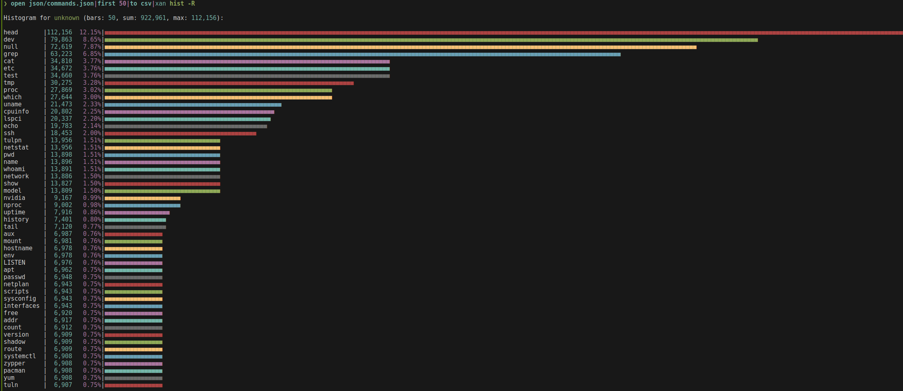

# nubeelzebub



**Nushell** scripts to analyze [Beelzebub](https://github.com/mariocandela/beelzebub) honeypot JSON outputs.

## 🛠 Prerequisites

To use these scripts, you must have the following installed and configured:

* **Nushell** with the `polars` plugin activated.
* **[Xan](https://github.com/medialab/xan)** for terminal-based graphing.
* Beelzebub JSON logs stored in `./log` in `.gz` format.

> [!IMPORTANT]
> The `slow` directory contains legacy scripts without Polars support. These are deprecated and significantly slower.

---

## 🚀 Usage

### 1. Extract to JSON
Generate processed outputs in the `./json` directory:
```nushell
source main-beel.nu

2. Data Exploration

Use these commands to interactively browse the captured logs:


# Display SSH commands
$dfssh | polars into-nu | explore

# Display HTTP commands
$dfhttp | polars into-nu | explore

# Display download commands
$download_commands | polars into-nu | explore

# Display decoded Base64 commands
$decoded | polars into-nu | explore

📊 Analytics & Visualization
Most Used Commands

Extract the top 50 SSH commands and display a frequency histogram in the terminal.
Extrait de code
$dfssh
    | polars get Command
    | polars filter ((polars col Command) != '')
    | polars rename Command value
    | polars value-counts
    | polars into-nu
    | str trim --char "'"
    | sort-by -r count
    | first 50
    | to csv
    | xan hist -R

Keyword Frequency Analysis

Split commands into individual words and filter by length to identify common malicious binaries or flags.
Extrait de code

$dfssh
    | polars get Command
    | polars select (polars col Command | polars str-split " " | polars explode)
    | polars rename Command value
    | polars filter ((polars col value) != '')
    | polars filter ((polars col value | polars str-lengths) > 3)
    | polars value-counts
    | polars into-nu
    | str trim --char "'"
    | sort-by -r count
    | first 50
    | to csv
    | xan hist -R
